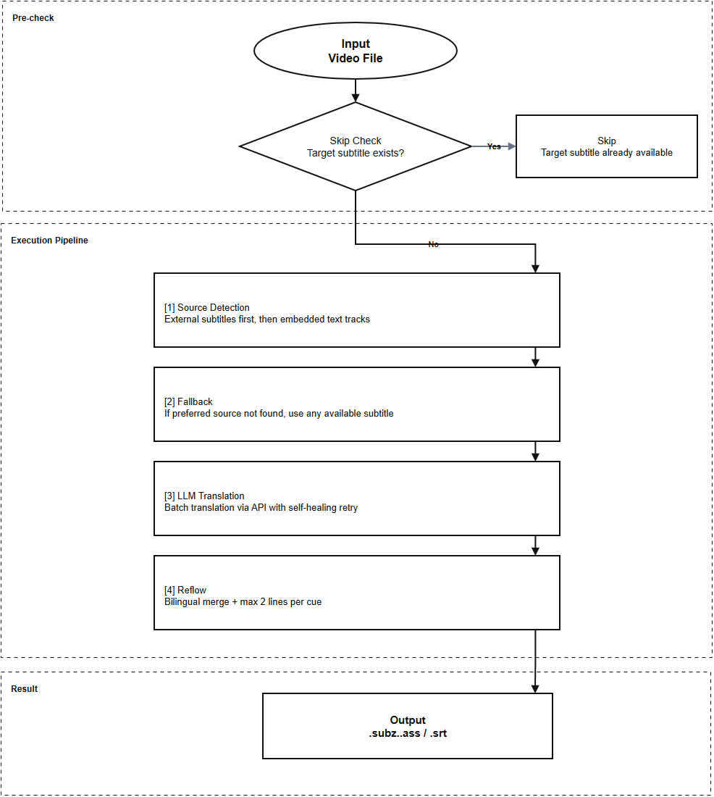

# SubZ

[English](README.md) | [中文](README.zh-CN.md)


SubZ is an Emby server plugin for **library-ingest/manual batch subtitle translation and bilingual subtitle generation** via LLM APIs.

   -16a34a) 

> API-first, no local model runtime required.

## Table of Contents

- [Compliance Notice](#compliance-notice)
- [Features](#features)
- [Workflow](#workflow)
- [Requirements](#requirements)
- [Supported Video File Types](#supported-video-file-types)
- [Install](#install)
- [Configuration](#configuration)
- [Manual Run API](#manual-run-api)
- [External Status Page (Optional)](#external-status-page-optional)
- [Credits](#credits)
- [License](#license)

## Compliance Notice

- SubZ does not provide or bundle media sources, scraping modules, or piracy-related functionality.
- SubZ only processes subtitles from your own library files and provider APIs you configure.
- You are responsible for ensuring your usage complies with local laws, copyright requirements, and third-party API terms.
- Before publishing/distributing this plugin, verify all bundled assets and dependencies are properly licensed.

## Features

- Embedded + external subtitle source detection
  - External subtitles first (`.srt/.ass/.ssa/.vtt`)
  - Fallback to embedded text subtitle tracks from media containers (e.g., MKV)
- Skip logic
  - Automatically skips when target-language subtitles already exist
- LLM translation pipeline
  - LLM `/chat/completions` translation
  - Batch translation + self-healing retry strategy
  - Automatic `thinking` capability detection
  - If supported, send `thinking=disabled` (non-thinking mode); if not supported, auto-fallback without `thinking`
- Runtime task control
  - Pause / Resume / Stop queue execution
  - Real-time status and runtime logs via API
- Bilingual subtitle output
  - Original + translated lines merged per cue
  - Reflow to max 2 lines per subtitle cue
- Output formats
  - `.ass` (with configurable font name/size)
  - `.srt`
- Execution modes
  - Manual target mode: run by specific **folder** or **file**
  - Library-ingest auto mode: enabled when `Enable plugin=true` and `Manual target only mode=false`
- Emby-native plugin UI and plugin card thumbnail support
- External lightweight status page support (optional)

## Workflow



## Requirements

- Emby Server 4.9+
- `ffprobe` and `ffmpeg` available in server runtime
- An LLM API key

## Supported Video File Types

SubZ currently scans and processes these video file extensions:

- `.mkv`
- `.mp4`
- `.m4v`
- `.avi`
- `.ts`
- `.m2ts`
- `.mov`

Notes:
- In manual **folder** mode, video files are scanned recursively in all subfolders.
- In manual **single-file** mode, the selected file must be one of the extensions above.

## Install

1. Use the packaged plugin DLL (`artifacts/plugin/SubZ.Plugin.dll`) or `SubZ.Plugin.dll`.

2. Copy the DLL to Emby plugins directory.

3. (Optional) Copy `subz-status.html` to your Emby config folder.

4. Restart Emby server.

## Configuration

### Configuration Panel Reference

| Option | Default | Detailed Description | Practical Notes |
|---|---|---|---|
| `Enable plugin` | `true` | Global on/off switch for SubZ runtime behavior. | Disable it for temporary maintenance without uninstalling. |
| `Manual target only mode` | `false` | When enabled, SubZ skips library-ingest auto trigger and only runs manual targets. | Set to `true` if you want strictly manual execution; keep `false` to allow ingest auto mode. |
| `Target language` | `zh-CN` | Target subtitle language code for translation output. | Existing subtitle in this language will trigger skip logic. |
| `Manual target folder` | empty | Folder used when running a manual job. | Scans video files recursively in this folder and subfolders. |
| `Manual target file` | empty | Single-file target used when running a manual job. | Use either folder or file target, not both. |
| `Run once now` | `false` | On save, asynchronously accepts and queues one manual translation job using the selected target. | Auto-resets to `false` after request acceptance; execution continues in background queue. |
| `Output format` | `srt` | Output subtitle format (`srt` or `ass`). | Choose `ass` when style control is required. |
| `ASS font name` | `微软雅黑` | Font family for ASS output text style. | Font must exist in rendering environment, otherwise fallback occurs. |
| `ASS font size` | `60` | Font size for ASS output text style. | Tune by player and resolution for readability. |
| `ASS font color` | `&H00FFFFFF` | Primary text color for ASS output. | Supports `&H00RRGGBB` or `#RRGGBB`. |
| `API provider` | `deepseek` | Provider label used by profile behavior hints/resolution. | Not hard-bound to one vendor; customizable label. |
| `API base URL` | `https://api.deepseek.com` | Base URL for LLM requests. SubZ calls `/chat/completions`. | Must match your provider-compatible API gateway. |
| `API key` | empty | Authentication credential for LLM API requests. | Keep secret and rotate when exposed. |
| `Model` | `deepseek-v4-flash` | Model identifier sent in request payload. | Strongly affects quality, speed, and token cost. |
| `Batch size` | `120` | Number of subtitle cues per translation request. | Larger is faster but increases timeout/misalignment risk. |
| `Preferred source language` | `en` | Preferred source subtitle language code used for external subtitle matching. | Example values: `en`, `ja`, `fr`, `zh-CN`. Falls back to any available subtitle when not found. |
| `FFmpeg path` | `/bin/ffmpeg` | Executable path used for embedded subtitle extraction. | Override this in non-Linux/container environments as needed. |
| `FFprobe path` | `/bin/ffprobe` | Executable path used for subtitle stream probing. | Keep aligned with your actual ffprobe binary location. |
| `Log file max size (MB)` | `10` | Maximum size of a single runtime log file before rolling. | Increase on busy servers to reduce rotation frequency. |
| `Log retention days` | `7` | Number of days to keep runtime log files. Older files are auto-pruned. | Keep lower values to control disk usage. |
| `Debug log mode` | `false` | Enables verbose debug logs including full LLM request/response body and ffprobe/ffmpeg execution details. | May include subtitle text and generate large logs; enable only when troubleshooting. |
| `Status page URL` | `http://localhost:18123/subz-status.html` | Stored URL for external status page access. | This does not host the page; it only stores a link. |
| `Preserve subtitle tags` | `true` | Protects tags/placeholders before translation and restores them after. | Keep enabled to reduce formatting corruption. |
| `Enable tail retry` | `true` | Enables self-healing retries for failed/unchanged segments. | Improves completeness when provider output is unstable. |
| `Tail retry attempts` | `2` | Maximum retry rounds for tail/healing retries. | Higher values improve recovery but increase latency/token usage. |
| `Prefer non-forced track` | `true` | Prefer non-forced subtitle tracks during source selection. | Avoids translating sparse forced-only lines. |
| `Prefer non-HI track` | `true` | Prefer non-hearing-impaired subtitle tracks. | Reduces SDH-style noise when alternatives exist. |
| `Prefer text subtitle track` | `true` | Prefer text subtitle tracks over image-based tracks. | Improves extraction reliability and translation quality. |

Default API profile:

- Provider: `deepseek`
- Base URL: `https://api.deepseek.com`
- Model: `deepseek-v4-flash`
- BatchSize: `120`
- ParallelRequests: `2`
- RetryCount: `2`

Thinking behavior:
- SubZ auto-detects whether the current provider/model supports the `thinking` field.
- If supported, SubZ enables non-thinking mode by sending `thinking=disabled`.
- If not supported, SubZ retries automatically without the `thinking` field and caches this capability per `baseUrl + model`.

## Manual Run API

- `POST /SubZ/Translate/Run`

Body (folder target):

```json
{
  "targetFolderPath": "/path/to/folder",
  "targetFilePath": null
}
```

Body (single file target):

```json
{
  "targetFolderPath": null,
  "targetFilePath": "/path/to/video.mkv"
}
```

Rules:
- Provide exactly one of `targetFolderPath` or `targetFilePath`
- Target path must exist

Status APIs:
- `GET /SubZ/Translate/Queue`
- `GET /SubZ/Translate/Status`
- `GET /SubZ/Translate/Status?LogLimit=120&LogSource=file` (read last lines from runtime log file)

Control via status endpoint:
- `GET /SubZ/Translate/Status?Cmd=pause`
- `GET /SubZ/Translate/Status?Cmd=resume`
- `GET /SubZ/Translate/Status?Cmd=stop`

Notes:
- If task state stays `Queued`, check `IsPaused` in status response.
- When `IsPaused=true`, queued jobs will not start until resumed.

## External Status Page (Optional)

SubZ keeps the Emby native plugin settings page unchanged.

For richer runtime monitoring, you can host an external HTML page that reads:
- `GET /SubZ/Translate/Status`
- `GET /SubZ/Translate/Queue`

Typical deployment:
- Place `subz-status.html` under your Emby config storage path.
- Serve it with any static web server (nginx/caddy/apache).
- Configure Emby base URL + Emby API Token in the page.

## Credits

- Inspired by workflow ideas from [Translate_Subs](https://github.com/dexusno/Translate_Subs)

## License

This project is licensed under the [MIT License](LICENSE).
